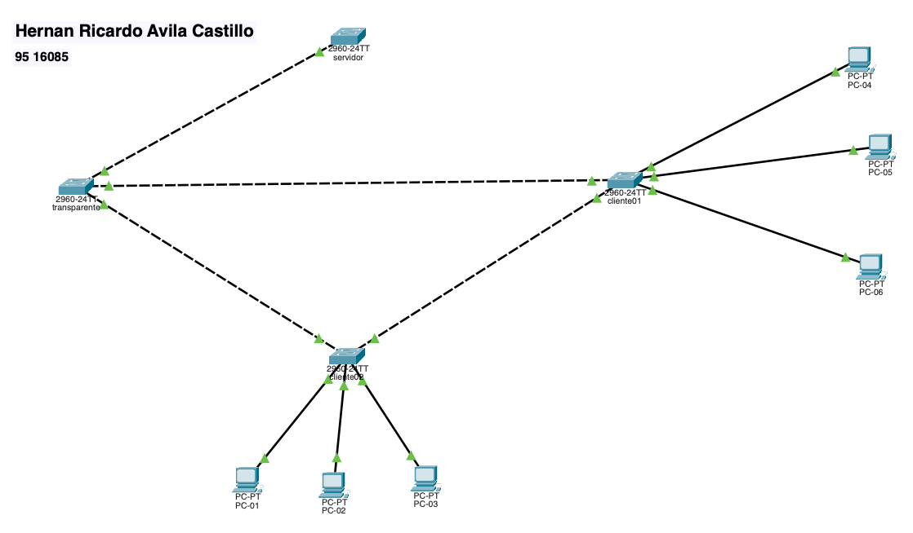
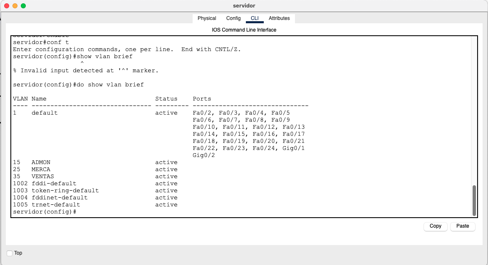
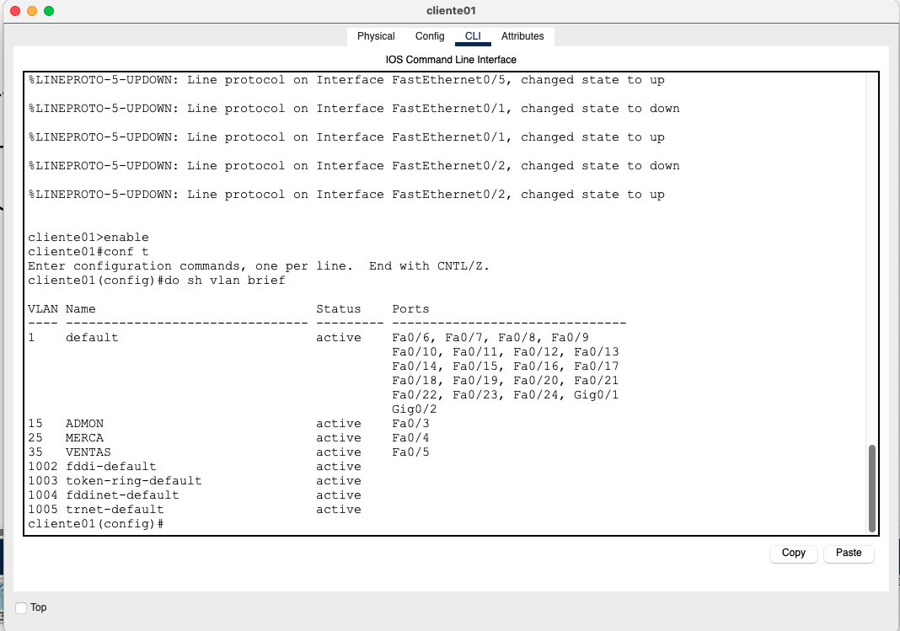
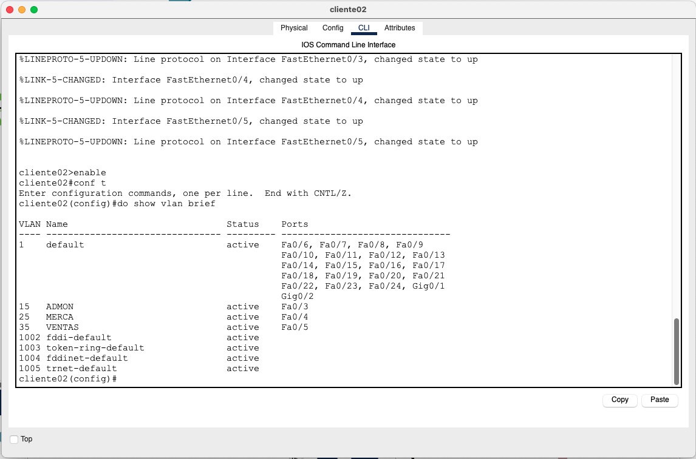
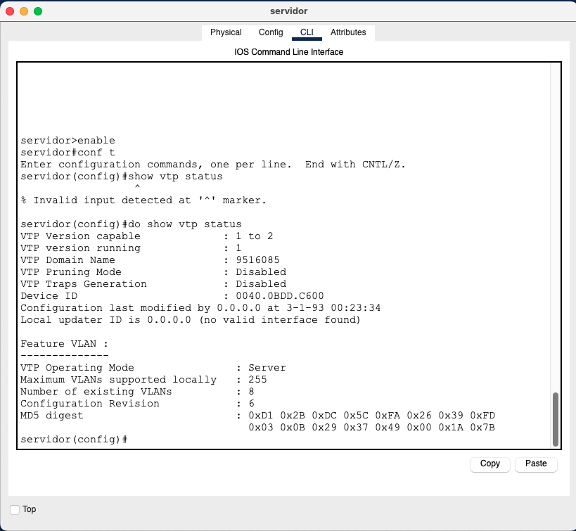
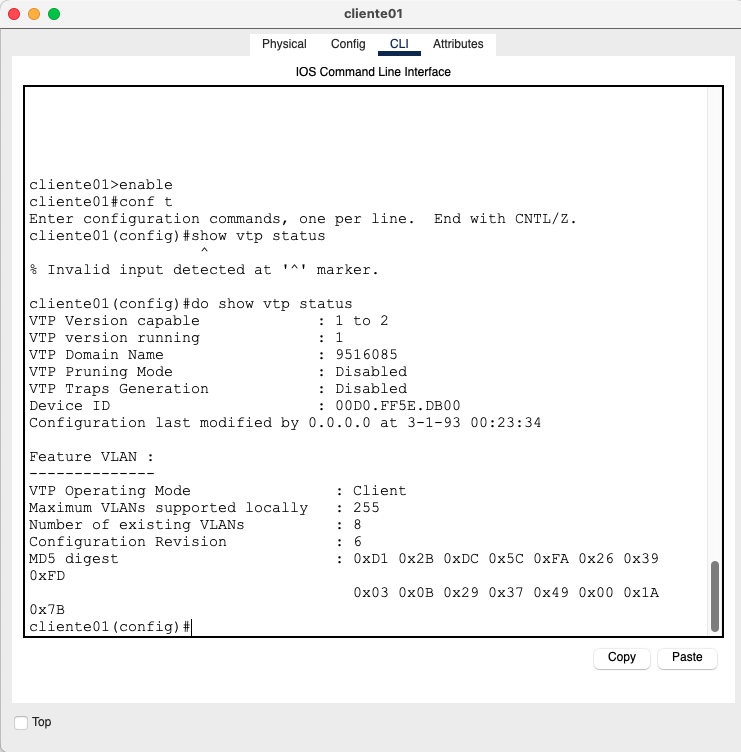
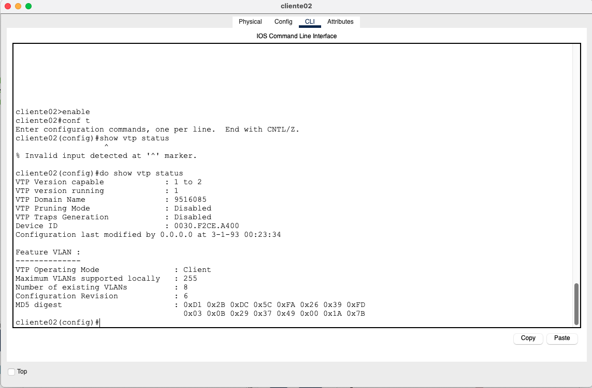

# Tarea 3 - Redes de Computadoras 1
**Universidad de San Carlos de Guatemala**  
**Facultad de Ingeniería – Escuela de Ciencias y Sistemas**  
**Nombre:** Hernán Ricardo Ávila Castillo  
**Carnet:** 9516085  

---

## Introducción
En esta práctica se implementó una topología con **VTP (VLAN Trunking Protocol)** utilizando cuatro switches Cisco 2960 y seis PCs en Cisco Packet Tracer. Se configuraron los diferentes modos de operación de VTP (**server, client, transparent**) y se verificó la propagación automática de VLANs, así como la conectividad entre dispositivos de la misma VLAN.

---

## Topología
  
*(coloca aquí tu captura de la topología final en Packet Tracer)*

---

## Configuración de los switches

### 🔹 Switch Servidor
```bash
enable
conf t
hostname servidor
vtp version 2
vtp domain 9516085
vtp password 9516085
vtp mode server

! Trunks
interface fa0/1
 switchport mode trunk
 switchport trunk native vlan 1
 switchport trunk allowed vlan 1,15,25,35
interface fa0/2
 switchport mode trunk
 switchport trunk native vlan 1
 switchport trunk allowed vlan 1,15,25,35

! VLANs creadas en servidor
vlan 15
 name ADMON
vlan 25
 name MERCA
vlan 35
 name VENTAS
end
write memory
```

### 🔹 Switch Transparente
```bash
enable
conf t
hostname transparente
vtp version 2
vtp domain 9516085
vtp password 9516085
vtp mode transparent

! Trunks
interface fa0/1
 switchport mode trunk
 switchport trunk native vlan 1
 switchport trunk allowed vlan 1,15,25,35
interface fa0/2
 switchport mode trunk
 switchport trunk native vlan 1
 switchport trunk allowed vlan 1,15,25,35
end
write memory
```

### 🔹 Switch Cliente01
```bash
enable
conf t
hostname cliente01
vtp version 2
vtp domain 9516085
vtp password 9516085
vtp mode client

! Trunks
interface fa0/1
 switchport mode trunk
 switchport trunk native vlan 1
 switchport trunk allowed vlan 1,15,25,35
interface fa0/2
 switchport mode trunk
 switchport trunk native vlan 1
 switchport trunk allowed vlan 1,15,25,35

! PCs
interface fa0/3
 switchport mode access
 switchport access vlan 15
 spanning-tree portfast
interface fa0/4
 switchport mode access
 switchport access vlan 25
 spanning-tree portfast
interface fa0/5
 switchport mode access
 switchport access vlan 35
 spanning-tree portfast
end
write memory
```

### 🔹 Switch Cliente02
```bash
enable
conf t
hostname cliente02
vtp version 2
vtp domain 9516085
vtp password 9516085
vtp mode client

! Trunks
interface fa0/1
 switchport mode trunk
 switchport trunk native vlan 1
 switchport trunk allowed vlan 1,15,25,35
interface fa0/2
 switchport mode trunk
 switchport trunk native vlan 1
 switchport trunk allowed vlan 1,15,25,35

! PCs
interface fa0/3
 switchport mode access
 switchport access vlan 15
 spanning-tree portfast
interface fa0/4
 switchport mode access
 switchport access vlan 25
 spanning-tree portfast
interface fa0/5
 switchport mode access
 switchport access vlan 35
 spanning-tree portfast
end
write memory
```

---

## VLANs propagadas
### Servidor


### Cliente01


### Cliente02


---

## 📌 Estado de VTP
### Servidor


### Cliente01


### Cliente02


---

## 📌 Pruebas de conectividad

### VLAN 15 (ADMON)
- PC1 (192.168.100.1) ↔ PC4 (192.168.100.4) ✅

### VLAN 25 (MERCA)
- PC2 (192.168.100.2) ↔ PC5 (192.168.100.5) ✅

### VLAN 35 (VENTAS)
- PC3 (192.168.100.3) ↔ PC6 (192.168.100.6) ✅

### Entre VLANs distintas
- PC1 ↔ PC2 ❌  
- PC2 ↔ PC6 ❌  
*(correcto: no deben comunicarse sin router-on-a-stick)*

---

## Conclusiones
- El protocolo VTP facilitó la administración de VLANs, al crearse solo en el servidor y propagarse automáticamente a los clientes.  
- Los enlaces trunk fueron necesarios para transportar múltiples VLANs entre switches.  
- Se comprobó la segmentación lógica de la red: PCs en la misma VLAN sí se comunican, mientras que PCs en VLAN diferentes no.  
- La práctica reforzó la importancia de verificar tanto configuración de switch (VLANs, VTP, trunks) como de host (IPs correctas).
